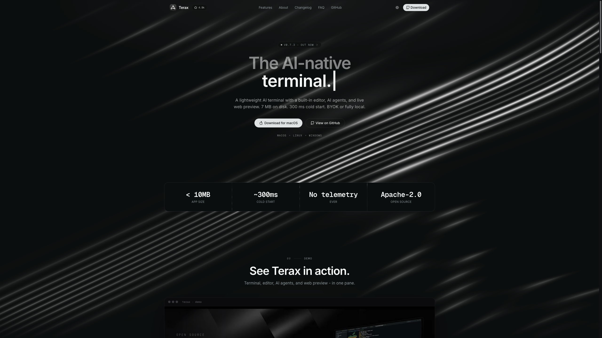

<div align="center">
  
  <h1>Terax Website</h1>

  <p><strong>The website and landing page for <a href="https://github.com/crynta/terax-ai">Terax</a>.</strong></p>

  <p>
    
    
    
  </p>

  <p><a href="https://terax.app">terax.app</a></p>
</div>

---

<p align="center">
  
</p>

The source for [terax.app](https://terax.app), the landing page for **Terax**, a lightweight terminal-first AI-native dev workspace. Open-sourced because people kept asking how the animated background and the overall design were built, so here it is, end to end.

The product itself lives in a separate repo: **[crynta/terax-ai](https://github.com/crynta/terax-ai)**.

## The animated background

The flowing line waves in the hero are the part most people ask about. It is a real-time WebGL shader, not a video or a Lottie file:

- [`components/site/background-waves.tsx`](components/site/background-waves.tsx) mounts the canvas and wires it into the page.
- [`components/line-waves.tsx`](components/line-waves.tsx) holds the [OGL](https://github.com/oframe/ogl) setup and the GLSL fragment shader that draws the lines.

Everything is plain GLSL on top of a tiny WebGL wrapper, so it is easy to read and tweak.

## Tech stack

- **Next.js 16** (App Router) + **React 19** + **TypeScript**
- **Tailwind CSS v4** + **shadcn/ui** components
- **[OGL](https://github.com/oframe/ogl)** for the WebGL shader background
- **[Motion](https://motion.dev)** for animations
- **[Hugeicons](https://hugeicons.com)** icon set
- Deployed on **Vercel**

## Run locally

**Prerequisites:** Node 20+ and [pnpm](https://pnpm.io).

```bash
pnpm install
pnpm dev          # http://localhost:3000
```

**Other scripts**

```bash
pnpm build        # production build
pnpm start        # serve the production build
pnpm typecheck    # tsc --noEmit
pnpm lint         # eslint
```

### Optional environment

The homepage shows the live GitHub star count via the GitHub API. Unauthenticated requests work fine but are rate-limited. To raise the limit, set a token:

```bash
GITHUB_TOKEN=your_token   # optional, read-only, public-repo scope is enough
```

Nothing else is required. There are no secrets, no accounts, and no telemetry.

## Structure

```
app/                Next.js routes (home, about, changelog, privacy, terms, security)
components/site/    Page sections (hero, demo, feature grid, footer, ...)
components/ui/       shadcn/ui primitives
lib/site.ts         Single source of truth: version, links, downloads
lib/changelog.ts    Changelog data
```

Want to change a download link or bump the shown version? It all lives in [`lib/site.ts`](lib/site.ts).

## License

Licensed under the [Apache-2.0 License](LICENSE), same as Terax itself.
